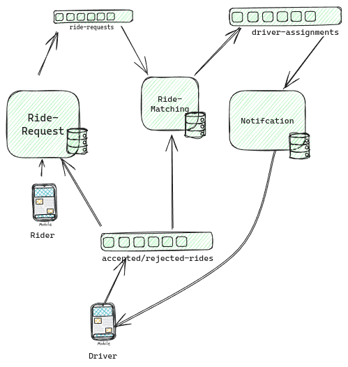

## Rideshare

**A backend for an app like Uber.**

## Notes

- now I want to only work on the happy path
- the following architecture is my working skeleton
- I will change the architrure as i learn more

## Architecture Style: Modular Monolith

The architecture is designed around the idea of being a monolith but modular enough to enable easy migration to microserivces(if scale is needed).

## Architectureal Decesions

- All the services are hidden from each other by design,  so no developer can import from any service he doesn't own

- service communcate by consumg and subscribing to events

- database per service is or database per domain if it reduces complexity more or help us being aynchronus

## Issues

- all the services are compleltey decpoupled

- someone has to start the services

- i can make each services runs on its own server 

- howeever, this is unneeded coomplexity, i will add for each services a public handle endpoint. the api can run it, and ther service will strat running in its serpate gourutinne.

## Tech Stack

- Programming Language: Go
- Broker: Kafka
- Database: MySQL
